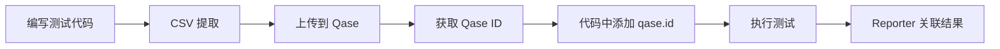

# Playwright Qase Reporter 配置指南

## 📋 概述

本文档说明如何配置 Playwright Qase Reporter，确保它与我们的 title 规范保持一致。

## 🎯 核心原则

### 我们的 Title 规范

```typescript
// 格式：TC-{LAYER}-{MODULE}-{NUMBER}: 标题 @tag1 @tag2
test('TC-UI-SMOKE-001: Workspace 加载无错误验证 @smoke', async ({ page }) => {
  // ...
})
```

### Playwright Qase Reporter 的默认行为

**✅ 好消息**：Playwright Qase Reporter **默认使用 test 的名称作为 title**！

如果不显式调用 `qase.title()`，Reporter 会自动使用：
```typescript
test('TC-UI-SMOKE-001: Workspace 加载无错误验证 @smoke', ...)
```
作为 Qase 中的 title。

## 🔧 配置方案

### 方案 1: 使用 Test 名称（推荐）

**无需额外配置**！只要 test 名称符合规范，Reporter 会自动使用。

```typescript
import { test } from '@playwright/test';

// ✅ Reporter 自动使用完整的 test 名称作为 title
test('TC-UI-SMOKE-001: Workspace 加载无错误验证 @smoke', async ({ page }) => {
  await test.step('导航到工作区', async () => {
    await page.goto('/workspace');
  });

  await test.step('验证页面加载', async () => {
    await page.waitForSelector('.workspace-container');
  });
});
```

**Qase 中的效果：**
```
Title: TC-UI-SMOKE-001: Workspace 加载无错误验证 @smoke
Custom ID: (自动从 title 提取或需手动关联)
```

### 方案 2: 使用 qase.id() 关联已有 Test Case（推荐用于更新）

如果 Qase 中已有 test case（通过 CSV 导入），使用 `qase.id()` 关联：

```typescript
import { test } from '@playwright/test';
import { qase } from 'playwright-qase-reporter';

// @qase-id 12345 (从 CSV 同步得到的 Qase ID)
test('TC-UI-SMOKE-001: Workspace 加载无错误验证 @smoke', async ({ page }) => {
  qase.id(12345); // 关联到 Qase 中的 test case ID

  await test.step('导航到工作区', async () => {
    await page.goto('/workspace');
  });
});
```

**优势：**
- ✅ Test 执行结果直接关联到已有的 test case
- ✅ 保持 title 和 Custom ID 的一致性
- ✅ 避免创建重复的 test case

### 方案 3: 显式设置 Title（不推荐，冗余）

```typescript
import { test } from '@playwright/test';
import { qase } from 'playwright-qase-reporter';

test('TC-UI-SMOKE-001: Workspace 加载无错误验证 @smoke', async ({ page }) => {
  // ❌ 不推荐 - 冗余，因为 test 名称已经包含完整 title
  qase.title('TC-UI-SMOKE-001: Workspace 加载无错误验证 @smoke');

  await page.goto('/workspace');
});
```

**为什么不推荐：**
- 重复维护 title（test 名称 + qase.title()）
- 容易不一致
- 违反 DRY 原则

## 📊 完整工作流

### 流程 1: CSV 导入 + Playwright Reporter（推荐）



**详细步骤：**

```bash
# 1. 编写测试代码（test 名称包含完整 title）
cat > e2e/specs/smoke-test.spec.ts << 'EOF'
import { test } from '@playwright/test';

test('TC-UI-SMOKE-001: Workspace 加载无错误验证 @smoke', async ({ page }) => {
  await test.step('导航到工作区', async () => {
    await page.goto('/workspace');
  });
});
EOF

# 2. 通过 CSV 导入到 Qase
node ~/.claude/skills/qase-testops-manager/scripts/generate-csv.js --update
node ~/.claude/skills/qase-testops-manager/scripts/sync-to-qase.js
node ~/.claude/skills/qase-testops-manager/scripts/sync-from-qase.js

# 3. 查看生成的 Qase ID 映射
cat e2e/qase/qase-id-mapping.json
# 输出: { "TC-UI-SMOKE-001": 12345 }

# 4. (可选) 在代码中添加 qase.id()
node ~/.claude/skills/qase-testops-manager/scripts/update-test-code.js

# 5. 执行测试，Reporter 自动关联结果
npx playwright test
```

**结果：**
- ✅ Qase 中有 test case（通过 CSV 创建）
- ✅ Test 执行结果自动关联（通过 qase.id()）
- ✅ Title 保持一致（test 名称 = CSV title = Qase title）

### 流程 2: 仅使用 Playwright Reporter（不推荐）

```typescript
import { test } from '@playwright/test';
import { qase } from 'playwright-qase-reporter';

test('TC-UI-SMOKE-001: Workspace 加载无错误验证 @smoke', async ({ page }) => {
  // Reporter 自动使用 test 名称作为 title
  await page.goto('/workspace');
});
```

**注意：**
- ❌ 没有 Custom ID 字段（Qase Reporter 不支持 Custom ID）
- ❌ 无法与 CSV 导入的 test case 关联
- ❌ Tags 需要手动添加：`qase.fields({ tags: ['@smoke'] })`

**不推荐的原因：**
- Qase Reporter 创建的 test case 缺少 Custom ID
- 与 CSV 导入的 test case 不兼容
- 管理分散，难以维护

## ⚙️ Playwright 配置

### playwright.config.ts

```typescript
import { defineConfig } from '@playwright/test';

export default defineConfig({
  // ... 其他配置

  reporter: [
    ['list'], // 控制台输出
    ['html'], // HTML 报告
    [
      'playwright-qase-reporter',
      {
        // Qase API 配置
        apiToken: process.env.QASE_API_TOKEN,
        projectCode: process.env.QASE_PROJECT_CODE,

        // Test run 配置
        runComplete: true, // 自动完成 test run

        // 上传配置
        uploadAttachments: true, // 上传截图和视频

        // 环境配置（可选）
        environment: process.env.QASE_ENVIRONMENT || 'production',

        // 根路径配置
        rootSuiteTitle: 'Playwright Tests',
      },
    ],
  ],

  // 环境变量
  use: {
    // ... 其他配置
  },
});
```

### 环境变量配置

```bash
# .env 文件
QASE_API_TOKEN=your_api_token_here
QASE_PROJECT_CODE=YOUR_PROJECT_CODE

# (可选) 指定环境
QASE_ENVIRONMENT=staging

# (可选) Test run 标题
QASE_RUN_TITLE="Automated Test Run $(date +'%Y-%m-%d %H:%M')"
```

## 🎯 最佳实践

### 1. 使用一致的 Test 名称

**✅ 推荐：**
```typescript
// Test 名称包含完整信息
test('TC-UI-SMOKE-001: Workspace 加载无错误验证 @smoke', async ({ page }) => {
  qase.id(12345); // 关联 Qase ID
  // ...
})
```

**❌ 避免：**
```typescript
// Test 名称过于简化
test('should load workspace', async ({ page }) => {
  qase.title('TC-UI-SMOKE-001: Workspace 加载无错误验证 @smoke'); // 冗余
  // ...
})
```

### 2. 使用 qase.id() 关联已有 Test Case

```typescript
import { qase } from 'playwright-qase-reporter';

// 从注解中读取 Qase ID
// @qase-id 12345
test('TC-UI-SMOKE-001: Workspace 加载无错误验证 @smoke', async ({ page }) => {
  qase.id(12345); // 关联到 Qase 中的 test case

  // 执行测试
  await page.goto('/workspace');
});
```

**自动化提取 Qase ID：**

可以创建一个辅助函数：

```typescript
// utils/qase-helpers.ts
export function extractQaseId(testInfo: any): number | undefined {
  const match = testInfo.title.match(/TC-[A-Z]+-[A-Z]+-(\d+):/);
  if (match) {
    const customId = `TC-${match[0]}`;
    // 从映射文件中查找 Qase ID
    const mapping = require('../e2e/qase/qase-id-mapping.json');
    return mapping[customId];
  }
  return undefined;
}

// 使用
test('TC-UI-SMOKE-001: Workspace 加载无错误验证 @smoke', async ({ page }, testInfo) => {
  const qaseId = extractQaseId(testInfo);
  if (qaseId) {
    qase.id(qaseId);
  }

  await page.goto('/workspace');
});
```

### 3. 使用 Test Steps

```typescript
test('TC-UI-SMOKE-001: Workspace 加载无错误验证 @smoke', async ({ page }) => {
  qase.id(12345);

  // Playwright 的 test.step() 会自动同步到 Qase
  await test.step('导航到工作区', async () => {
    await page.goto('/workspace');
  });

  await test.step('验证页面加载', async () => {
    await page.waitForSelector('.workspace-container');
  });

  await test.step('检查错误日志', async () => {
    const errors = await page.evaluate(() => {
      return (window as any).errors || [];
    });
    expect(errors).toHaveLength(0);
  });
});
```

**Qase 中的效果：**
```
Test Case: TC-UI-SMOKE-001: Workspace 加载无错误验证 @smoke
Steps:
  1. 导航到工作区
  2. 验证页面加载
  3. 检查错误日志
```

## 🔄 与 CSV 导入的对比

| 特性 | CSV 导入 | Playwright Reporter | 推荐 |
|------|----------|---------------------|------|
| **创建 Test Case** | ✅ | ✅ | CSV 导入 |
| **Custom ID** | ✅ | ❌ | CSV 导入 |
| **Title 控制** | ✅ | ✅ | 两者一致 |
| **Test Steps** | ✅ | ✅ | 两者一致 |
| **Tags** | ✅ | 需手动 | CSV 导入 |
| **执行结果** | ❌ | ✅ | Reporter |
| **批量管理** | ✅ | ❌ | CSV 导入 |

**推荐组合：**
1. **CSV 导入** - 创建和管理 test cases
2. **Playwright Reporter** - 上报执行结果

## 📝 完整示例

### 示例 1: 新测试从零开始

```typescript
// Step 1: 编写测试代码
// e2e/specs/smoke-test.spec.ts
import { test, expect } from '@playwright/test';
import { qase } from 'playwright-qase-reporter';

test('TC-UI-SMOKE-001: Workspace 加载无错误验证 @smoke', async ({ page }) => {
  await test.step('导航到工作区', async () => {
    await page.goto('/workspace');
  });

  await test.step('验证页面加载', async () => {
    await expect(page.locator('.workspace-container')).toBeVisible();
  });
});
```

```bash
# Step 2: 通过 CSV 创建 test case
node ~/.claude/skills/qase-testops-manager/scripts/generate-csv.js --update
node ~/.claude/skills/qase-testops-manager/scripts/sync-to-qase.js
node ~/.claude/skills/qase-testops-manager/scripts/sync-from-qase.js

# Step 3: 查看 Qase ID
cat e2e/qase/qase-id-mapping.json | jq '.["TC-UI-SMOKE-001"]'
# 输出: 12345
```

```typescript
// Step 4: 更新测试代码，添加 qase.id()
// e2e/specs/smoke-test.spec.ts
import { test, expect } from '@playwright/test';
import { qase } from 'playwright-qase-reporter';

// @qase-id 12345
test('TC-UI-SMOKE-001: Workspace 加载无错误验证 @smoke', async ({ page }) => {
  qase.id(12345); // 关联 Qase test case

  await test.step('导航到工作区', async () => {
    await page.goto('/workspace');
  });

  await test.step('验证页面加载', async () => {
    await expect(page.locator('.workspace-container')).toBeVisible();
  });
});
```

```bash
# Step 5: 执行测试
npx playwright test smoke-test.spec.ts
```

**结果：**
- ✅ Qase 中有 test case (ID: 12345, Custom ID: TC-UI-SMOKE-001)
- ✅ Test 执行结果关联到该 test case
- ✅ Title 保持一致

### 示例 2: 使用自动 ID 关联

创建一个 fixture 来自动关联 Qase ID：

```typescript
// fixtures/qase-fixture.ts
import { test as base } from '@playwright/test';
import { qase } from 'playwright-qase-reporter';
import qaseIdMapping from '../e2e/qase/qase-id-mapping.json';

export const test = base.extend({
  autoQaseId: async ({}, use, testInfo) => {
    // 从 test title 提取 Custom ID
    const match = testInfo.title.match(/(TC-[A-Z]+-[A-Z]+-\d+):/);
    if (match) {
      const customId = match[1];
      const qaseId = qaseIdMapping[customId];
      if (qaseId) {
        qase.id(qaseId);
      }
    }
    await use();
  },
});
```

```typescript
// e2e/specs/smoke-test.spec.ts
import { test } from '../fixtures/qase-fixture';
import { expect } from '@playwright/test';

// 自动关联 Qase ID，无需手动调用 qase.id()
test('TC-UI-SMOKE-001: Workspace 加载无错误验证 @smoke', async ({ page, autoQaseId }) => {
  await test.step('导航到工作区', async () => {
    await page.goto('/workspace');
  });

  await test.step('验证页面加载', async () => {
    await expect(page.locator('.workspace-container')).toBeVisible();
  });
});
```

## 🎓 总结

### ✅ 推荐做法

1. **Test 名称包含完整 title**
   ```typescript
   test('TC-UI-SMOKE-001: Workspace 加载无错误验证 @smoke', ...)
   ```

2. **CSV 导入创建 test case**
   ```bash
   generate-csv.js → sync-to-qase.js → sync-from-qase.js
   ```

3. **使用 qase.id() 关联结果**
   ```typescript
   qase.id(12345); // 从 qase-id-mapping.json 获取
   ```

4. **Playwright Reporter 上报执行结果**
   - 自动使用 test 名称作为 title
   - 关联到已有的 test case
   - 同步 test steps

### ❌ 避免做法

1. **不要使用 qase.title() 重复设置 title**
   ```typescript
   // ❌ 冗余
   test('TC-UI-SMOKE-001: ...', async () => {
     qase.title('TC-UI-SMOKE-001: ...'); // 不需要
   })
   ```

2. **不要只依赖 Playwright Reporter 创建 test case**
   - 缺少 Custom ID
   - Tags 管理不便
   - 与 CSV 导入不兼容

3. **不要在 test 名称中省略 Custom ID**
   ```typescript
   // ❌ 不推荐
   test('Workspace 加载测试', ...)

   // ✅ 推荐
   test('TC-UI-SMOKE-001: Workspace 加载测试 @smoke', ...)
   ```

### 📊 完整工作流程

```
1. 编写测试代码 (test 名称包含完整 title)
   ↓
2. CSV 提取 (generate-csv.js)
   ↓
3. 上传到 Qase (sync-to-qase.js)
   ↓
4. 获取 Qase ID (sync-from-qase.js)
   ↓
5. (可选) 代码中添加 qase.id() 注解 (update-test-code.js)
   ↓
6. 执行测试 (npx playwright test)
   ↓
7. Reporter 自动关联结果到 Qase
```

通过这种方式，你的 test title 在**代码、CSV、Qase 三处保持完全一致**！🎉
